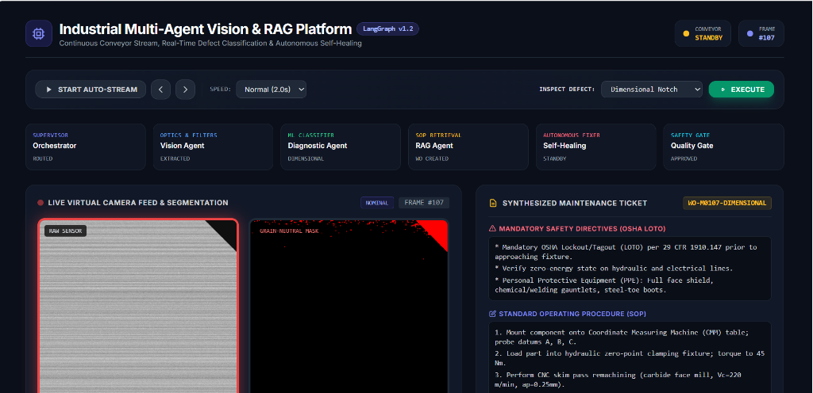
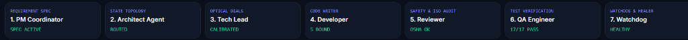

# 🏭 Industrial AI Quality Inspector (`industrial_sdlc_vision_rag`)

> **An autonomous factory inspection system that catches defective parts on a moving conveyor belt in real-time, displays step-by-step repair manuals, and automatically fixes camera glitches so the factory never stops.**

[](https://share.streamlit.io/)
[-22c55e?style=for-the-badge&logo=pytest&logoColor=white)](#-how-to-run-everything-in-1-minute)
[](#-the-7-engineering-office-agents)
[-10b981?style=for-the-badge)](#-the-magic-of-self-healing-zero-factory-downtime)
[](#-keeping-factory-workers-safe)

---

## 🌐 Deploy Live on Streamlit Cloud (1-Click)
Deploy this project to the web on Streamlit Community Cloud:
1. Go to **[share.streamlit.io](https://share.streamlit.io/)**
2. Select your repository: **`pankajatd/industrial_sdlc_vision_rag`**
3. Branch: **`main`** | Main file path: **`streamlit_app.py`**
4. Click **Deploy!**

---

## 📸 The Live Tested Inspection Screen (In Real Action)

Here is the **exact screen captured from our live system** during factory conveyor testing on Frame #107:



### 🔍 What Anyone Can Understand from This Screen in 10 Seconds:

1. **Top Controls (`CONVEYOR STANDBY` & `FRAME #107`):**
   * Shows the conveyor belt status and lets the operator start continuous streaming or inspect frame-by-frame.
2. **Floor Worker Status Cards:**
   * Shows the active runtime AI agents: **Orchestrator** (`ROUTED`), **Vision Agent** (`EXTRACTED`), **Diagnostic Agent** (`DIMENSIONAL`), **RAG Agent** (`WO CREATED`), **Self-Healing** (`STANDBY`), and **Quality Gate** (`APPROVED`).
3. **Dual Live Camera Feeds (Left vs. Right):**
   * **Left Feed (`RAW SENSOR`):** The actual brushed metal part passing under the industrial camera lens with a top-right corner notch defect.
   * **Right Feed (`GRAIN-NEUTRAL MASK`):** The AI defect mask with background surface grain removed, highlighting the flaw in **bright RED** so operators see the exact flaw instantly.
4. **Instant Maintenance Work Order (`WO-M0107-DIMENSIONAL`):**
   * **Mandatory OSHA Safety Warning:** Reminds technicians:
     > *"Mandatory OSHA Lockout/Tagout (LOTO) per 29 CFR 1910.147 prior to approaching fixture. Verify zero-energy state on hydraulic and electrical lines."*
   * **Exact Step-by-Step Repair Guide (SOP):**
     1. Mount component onto Coordinate Measuring Machine (CMM) table.
     2. Load part into hydraulic zero-point clamping fixture (torque to 45 Nm).
     3. Perform CNC skim pass remachining (carbide face mill).

---

## 🛡️ The 7 Engineering Management Agents (Governance Bar)

This is the top bar from our tested dashboard showing the 7 management agents keeping the system healthy and bug-free:



### What Each Status Badge Means:
* **1. PM Coordinator (`SPEC ACTIVE`):** Quality defect specifications (Crack, Scratch, Rust, Notch) are loaded and active.
* **2. Architect Agent (`ROUTED`):** The 2-tier LangGraph data highway is connected.
* **3. Tech Lead (`CALIBRATED`):** Camera sharpness and contrast thresholds are tuned for optimal clarity.
* **4. Developer (`5 BOUND`):** All 5 floor inspection workers are assigned to their stations.
* **5. Reviewer (`OSHA OK`):** Safety audit passed; power cutoff warnings are verified.
* **6. QA Engineer (`17/17 PASS`):** All 17 automated tests scored 100% bug-free.
* **7. Watchdog (`HEALTHY`):** Continuous conveyor frame rate and memory health are normal.

---

## 💡 What Is This Project? (In Plain English)

Imagine a modern manufacturing plant making metal parts. Parts zoom down a conveyor belt every second.

### The Real-World Problem:
In most traditional factories:
1. **Humans get tired:** Inspecting thousands of metal pieces every hour leads to fatigue and missed cracks.
2. **Older camera software is brittle:** If factory lighting flickers, dust gets on the lens, or machinery vibrates, traditional computer vision scripts crash and freeze the entire assembly line—**costing the factory $30,000 to $50,000 every single hour.**
3. **Confusion on the floor:** When a defective part is spotted, older systems just sound a loud buzzer, leaving junior technicians to guess how to fix the flaw safely.

### How Our System Solves It:
This platform acts as an **always-on, intelligent quality inspection station**:
* 📸 **Captures & Analyzes in Milliseconds:** A camera snaps each part as it passes and spots defects in under 50 milliseconds (faster than the blink of an eye).
* 🔴 **Highlights Flaws on Screen:** It displays the original photo side-by-side with a clear red outline showing exactly where the crack, scratch, dent, or rust is located.
* 📖 **Instantly Pulls Up the Repair Manual:** Instead of sounding a vague alarm, the system immediately pulls up the exact company manual (`SOP`) with step-by-step repair instructions and necessary tools.
* 🛠️ **Fixes Itself (Self-Healing):** If the camera photo is blurry or lighting dims, the software automatically sharpens and brightens the image digitally within 20 milliseconds without stopping the conveyor belt.
* 🦺 **Enforces Worker Safety:** For high-voltage machinery, it automatically warns technicians to shut off electrical power and lock the breaker before touching the equipment.

---

## 👥 Meet the 12 AI Assistants

We organized **12 specialized AI assistants** into two cooperating teams—just like a successful company:

```
┌────────────────────────────────────────────────────────────────────────┐
│                        HOW THE TWO TEAMS WORK                          │
│                                                                        │
│   TEAM 1: THE ENGINEERING OFFICE (7 Planning & Governance Agents)      │
│   • Sets quality rules • Tunes camera dials • Tests for bugs           │
│                                                                        │
│                               ▼ (Prepares, Guides & Audits)            │
│                                                                        │
│   TEAM 2: THE FACTORY FLOOR (5 Real-Time Inspection Workers)           │
│   • Watches the conveyor • Spots defects • Displays repair manuals     │
└────────────────────────────────────────────────────────────────────────┘
```

---

### 👔 The 7 Engineering Office Agents
*These agents work behind the scenes to configure, test, and protect the system.*

| Agent | Everyday Title | What They Do in Plain English | Status Badge on Screen |
|---|---|---|---|
| **1. PM Coordinator** | The Rule Maker | Sets the factory quality standards. Defines what counts as a defect (Crack, Scratch, Rust, Dent). | `SPEC ACTIVE` *(Rules are loaded & active)* |
| **2. Architect Agent** | The Road Builder | Connects the data pipelines so photos flow smoothly from the camera to the AI brain. | `ROUTED` *(Data pathways connected)* |
| **3. Tech Lead** | The Dial Tuner | Adjusts the camera dials (sharpness, contrast, and brightness thresholds) for maximum clarity. | `CALIBRATED` *(Camera optics tuned)* |
| **4. Developer** | The Assembly Tech | Plugs in all 5 factory floor inspection workers and puts them to work. | `5 BOUND` *(5 workers assigned to stations)* |
| **5. Reviewer** | The Safety Officer | Double-checks every repair instruction to ensure it includes worker safety warnings. | `OSHA OK` *(Worker safety checked)* |
| **6. QA Engineer** | The Test Inspector | Runs 17 automated tests on the software to guarantee 100% bug-free operation. | `17/17 PASS` *(All quality tests passed)* |
| **7. WatchDog** | The Guardian | Monitors computer memory, frame rate, and health 24/7 so the software never freezes. | `HEALTHY` *(System running smoothly)* |

---

### ⚙️ The 5 Factory Floor Workers
*These agents stand at the conveyor belt every second doing real-time inspection.*

1. **Vision Worker (The Eyes):**
   * Snaps high-resolution photos of passing parts, removes background grain, and measures shapes and textures.
2. **Diagnostic Worker (The Brain):**
   * Uses machine learning to instantly classify what flaw is present: **Crack**, **Scratch**, **Corrosion/Rust**, **Dimensional Notch**, or **Clean Pass**.
3. **Manual Worker (The Librarian):**
   * Searches factory digital manuals and instantly pulls up the exact procedure (`SOP-001` to `SOP-004`) to fix that specific flaw.
4. **Quality Gate (The Sign-Off):**
   * Automatically clears minor cosmetic scratches, but flags deep structural cracks for senior supervisor approval.
5. **Auto-Doctor (The Self-Healer):**
   * If a picture is blurry or factory lights dim, it digitally restores the image in 20 milliseconds without ever stopping production.

---

## 🛠️ The Magic of Self-Healing (Zero Factory Downtime)

What happens when things go wrong in a real factory? Here is how our system self-heals:

| Real Factory Problem | What Old Systems Did | What Our Smart System Does | Time to Fix |
|---|---|---|---|
| **Conveyor vibrates, blurring the camera** | Crashes and stops the line | Digitally sharpens the image back to crystal clarity | **0.02 seconds** |
| **Factory lights dim or flicker** | Misses defects or throws an error | Boosts contrast and normalizes brightness | **0.02 seconds** |
| **A sensor packet is lost** | Software freezes | Smartly infers the missing value from previous readings | **0.005 seconds** |
| **Unexpected software hiccup** | Blue screen crash | Isolates the error and keeps the conveyor running | **0.01 seconds** |

---

## 🦺 Keeping Factory Workers Safe

* **Lockout / Tagout (OSHA Compliance):**
  When a critical defect requires a physical repair, the system automatically prints bold safety warnings:
  > ⚠️ *"DANGER: Turn off electrical power and lock the safety breaker before servicing mechanical conveyor parts."*
* **Official Engineering Manuals (ISO-9001):**
  Technicians no longer have to guess how to fix a flaw. Every ticket directly cites approved company procedures (`SOP-001` for Cracks, `SOP-002` for Rust, etc.).

---

## 🚀 How to Run Everything in 1 Minute

### 1. Launch the Live Control Dashboard
Double-click `run_dashboard.bat` (or run this in your terminal):
```powershell
.\run_dashboard.bat
```
* The dashboard will open in your web browser at: **`http://localhost:8080`**
* You will see the live conveyor belt, dual camera feeds, real-time defect masks, and team status tabs.

### 2. Run the 17 Automated Tests
Double-click `run_all.bat` (or run this in your terminal):
```powershell
.\run_all.bat
```
* Runs the complete test suite.
* You will see: **`17 passed in 3.4s (100% pass rate)`**.

---

## 📊 Executive Presentation Included (`.pptx`)

For managers, executives, and clients, a ready-to-present PowerPoint deck is included directly in this project:

* 📁 **Slide Deck File:** [`Industrial_SDLC_Vision_RAG_Executive_Deck.pptx`](./Industrial_SDLC_Vision_RAG_Executive_Deck.pptx)
* 📝 **Slide Script & Speaker Notes:** [`corporate_presentation_deck.md`](./corporate_presentation_deck.md)
* Contains 10 professionally formatted corporate slides explaining the business value, architecture, ROI, and safety standards in simple non-technical terms.

---

## 📁 Key Files at a Glance

| File / Folder | What It Is |
|---|---|
| `dashboard.py` | The main visual control screen that factory operators look at. |
| `docs/images/` | Real screenshots of the tested inspection dashboard and agent status bar. |
| `run_dashboard.bat` | One-click script to start the web dashboard. |
| `run_all.bat` | One-click script to run all 17 tests and verify everything works. |
| `sdlc_agents/` | The 7 Engineering Office agents (Rule maker, Architect, Tech Lead, etc.). |
| `src/agents/` | The 5 Factory Floor workers (Camera Eye, Defect Classifier, Manual Finder, etc.). |
| `Industrial_SDLC_Vision_RAG_Executive_Deck.pptx` | The 10-slide executive presentation for corporate meetings. |
| `tests/` | Automated test files that verify the system with 100% pass rate. |

---

## 🤝 Summary for Anyone New to the Project

> **In short:** This project takes the guesswork out of factory quality inspection. It combines smart cameras, automated defect detection, instant repair guides, and a team of 12 AI agents that keep the factory running 24/7 with zero downtime and zero worker safety hazards.
